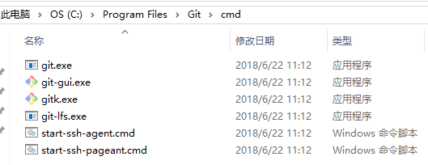

## git加入环境变量
*问题*：安装git后在git-bash中可以使用git命令，在windows命令行和webstorm的terminal工具中无法使用git；

*解决*：将git添加到环境变量；

右键单击‘计算机’ -> '属性' -> ‘高级系统设置’-> ‘环境变量’ -> “系统变量”中的‘path’ -> 选中path并选择编辑 -> 将以下路径复制进去：
+git安装路径中cmd文件夹的路径 （如 C:\Program Files\Git\cmd\）+

## 克隆代码
`git clone <url> [自定义文件夹名称]`

1  进入代码文件夹，运行`git remote`能够看到远程仓库的名称，默认为origin；

2  切换到需要的分支；

因为代码不包含node_mosules，需要先运行`yarn` 或 `npm install`下载依赖；

## 协作流程
1  `git chackout <branch>` 切换分支（根据任务的版本定位）, `git pull`使代码到最新状态；

2  在对应分支上进行修改；

3  修改后提交到本地；

4  `git pull` 拉下远程最新代码（如果有冲突手动解决）；

5  `git push` 推送本地提交。

`git diff` 尚未暂存的文件更新了哪些部分;

`git diff --cached(staged)` 已暂存的文件更新了哪些部分;

`git mv file_from file_to` 对文件重命名

## 查看提交历史
[参考手册](https://git-scm.com/book/zh/v2/Git-%E5%9F%BA%E7%A1%80-%E6%9F%A5%E7%9C%8B%E6%8F%90%E4%BA%A4%E5%8E%86%E5%8F%B2)

+ `git log` 按提交时间列出所有更新
+ `git log -p -2` 显示最近两次提交的内容差异
+ `git log --stat` 每次提交的简略统计信息
+ `git log --graph` 显示ASCII图形表示的分支合并历史

## 远程仓库使用
[参考手册](https://git-scm.com/book/zh/v2/Git-%E5%9F%BA%E7%A1%80-%E8%BF%9C%E7%A8%8B%E4%BB%93%E5%BA%93%E7%9A%84%E4%BD%BF%E7%94%A8)
+ `git fetch [remote-name]` 访问远程仓库拉取上次更新后新推送的所有工作，但不会自动合并；
+ `git pull` 会从克隆的服务器上抓取数据并自动尝试合并到本地当前分支；
+ `git remote show` 远程仓库名（origin） 查看特定分支执行git pull 或git push会连接哪一个远程分支；
+ `git remote rename namefrom nameto` 重命名远程分支，同样会修改远程分支名
+ `git remote rm [仓库名]` 移除远程仓库 

## 关于分支
[参考手册](https://git-scm.com/book/zh/v2/Git-%E5%88%86%E6%94%AF-%E5%88%86%E6%94%AF%E7%9A%84%E6%96%B0%E5%BB%BA%E4%B8%8E%E5%90%88%E5%B9%B6)
+ 切换分支之前，最好保持干净状态，避免无法切换；
+ 切换分支时，git会自动修改本地文件到对应分支最后一次提交的状态；
+ 合并分支到master: 先切换回master分支，再合并

`git checkout master`

`git merge hotfix`
+ 合并之后可以删除该分支 `git checkout -d hotfix`

`git mergetool` 启动可视化合并工具，一步一步解决冲突；

+ `git branch` 查看分支列表
+ `git branch --no-merged` 查看含有未合并内容的其他分支
+ `git branch -D [分支名]` 强制删除分支

## 储藏stash
+ 在一个分支中修改到一半，现在需要切换到别的分支，当前分支修改不想提交，可以先储存在栈中：
`git stash` 储存当前修改；这时运行status就像提交之后一样干净,可以切换到别的分支；
+ 再次切换回来后，可以使用`git stash apply`应用之前的储存；（当有多个存储，默认最近的存储，也可以通过`git stash apply stash@{index}`指定较旧的存储）
+ `git stash list` 查看已有的存储列表
+ `git stash drop stash@{index}` 删除指定的存储

## git版本回退
可能情况：commit之后，希望撤回这一次提交回到提交之前的版本；

`git reset [--mixed] HEAD~ `，代表将分支状态和暂存区状态回退到最近一次commit之前的状态，相当于将上一次的commit和add动作撤销，而修改的内容还在工作区；

其中`[--mixed]`为默认可省略选项；如果希望保留暂存区状态显示设置`--soft`；如果希望把所有更改在分支、暂存区、工作区都清除，设置`--hard`(较危险，不可逆)

